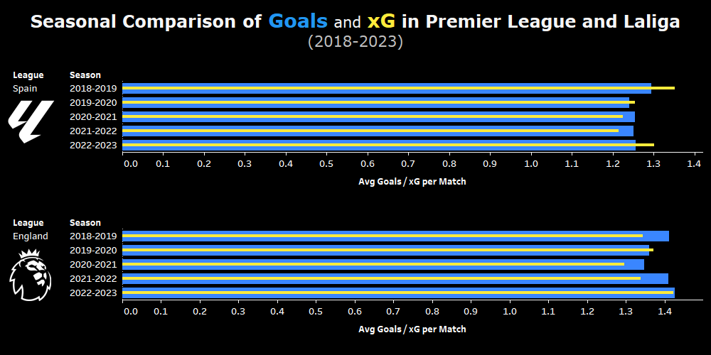
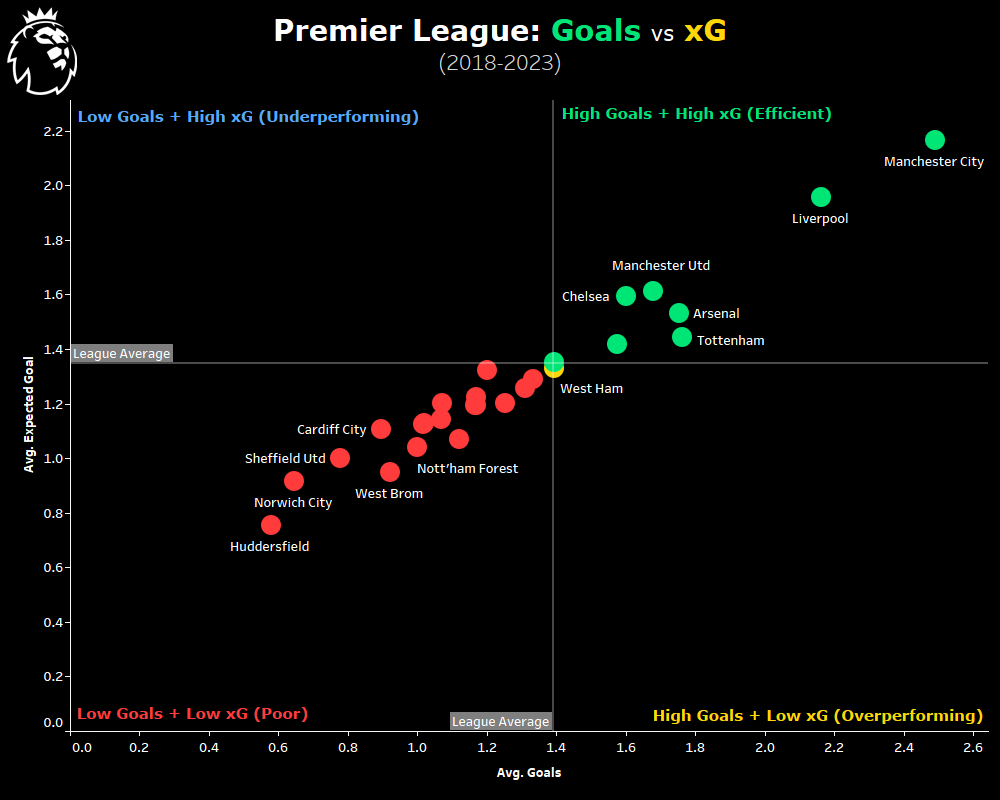
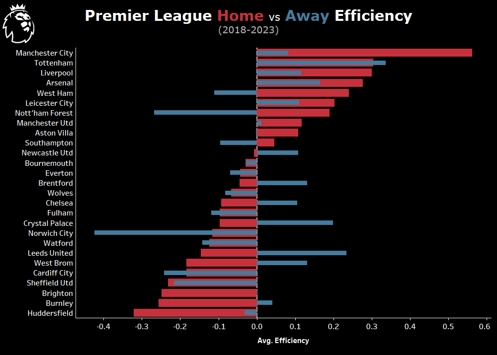
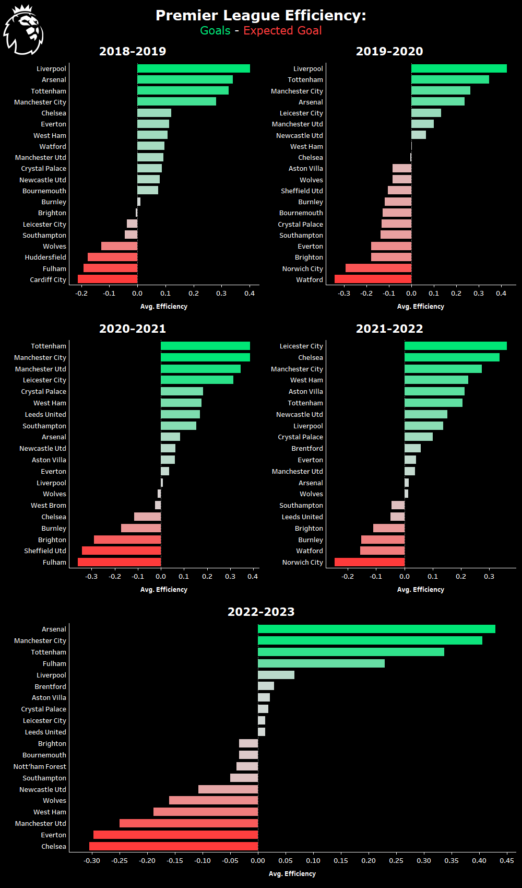

# A Comparative Analysis of Team Performance in the Premier League and LaLiga (2018–2023)

## Project Overview

This project compares team performance in the Premier League and LaLiga using Goals, Expected Goals (xG), and a custom Efficiency metric.

## Objectives

- Compare attacking output between leagues
- Evaluate finishing efficiency
- Analyze home and away performance
- Investigate seasonal trends

## Tools

- Python (Pandas)
- Tableau
- FBref Data

## Efficiency Metric

Efficiency = Goals - xG

Positive values indicate overperformance while negative values indicate underperformance.

## Project Workflow

FBref Data
→ Python Preprocessing
→ Season Creation
→ Efficiency Calculation
→ CSV Export
→ Tableau Dashboards
→ Final Analysis

## Repository Contents

- Python preprocessing code
- Final dataset
- Tableau dashboard
- Research article
- Technical documentation

## Dashboard Examples

### Seasonal Goal and xG Comparison

### Goals vs Expected Goals

### Home vs Away Efficiency

### Seasonal Efficiency Trends

